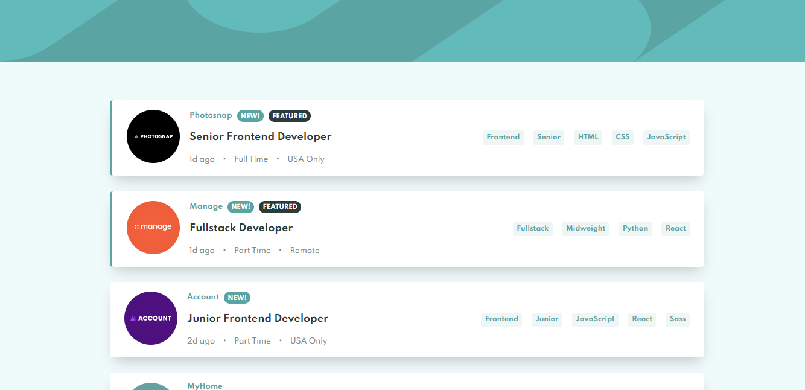
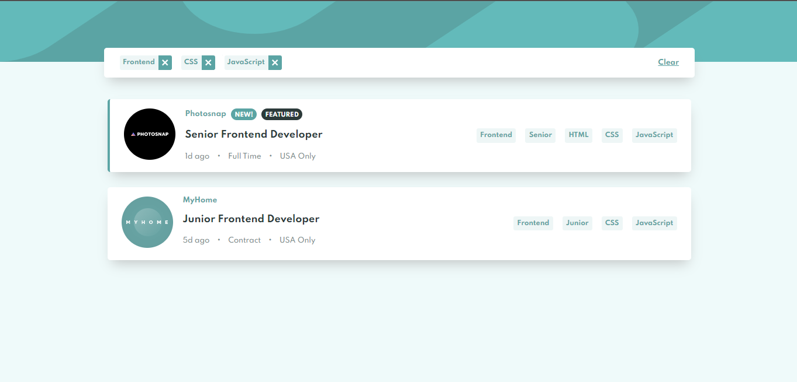

# Frontend Mentor - Job listings with filtering solution

This is a solution to the [Job listings with filtering challenge on Frontend Mentor](https://www.frontendmentor.io/challenges/job-listings-with-filtering-ivstIPCt)

## Table of contents

- [Overview](#overview)
  - [The challenge](#the-challenge)
  - [Screenshot](#screenshot)
  - [Links](#links)
- [My process](#my-process)
  - [Built with](#built-with)
  - [Useful resources](#useful-resources)
- [Author](#author)
- [Acknowledgments](#acknowledgments)

## Overview

### The challenge

Users should be able to:

- View the optimal layout for the site depending on their device's screen size
- See hover states for all interactive elements on the page
- Filter job listings based on the categories

### Screenshot

### Links

- Solution URL: [ https://www.frontendmentor.io/solutions/job-listings-with-filtering-react-redux-and-typescript-VMvBfPtnh](https://www.frontendmentor.io/solutions/job-listings-with-filtering-react-redux-and-typescript-VMvBfPtnh)
- Live Site URL: [https://job-listings-with-filtering-45f212.netlify.app/](https://job-listings-with-filtering-45f212.netlify.app/)

## My process

### Built with

- [React](https://reactjs.org/) - JS library
- [TypeScript](https://www.typescriptlang.org/) - TypeScript
- [Redux]()
- [React-Redux]()

### Useful resources

- [React With TypeScript Best Practices](https://www.sitepoint.com/react-with-typescript-best-practices/) - This is an amazing article which helped me finally understand using react and typeScript. I'd recommend it to anyone still learning this concept.
- [React with TypeScript cheatsheet](https://github.com/typescript-cheatsheets/react) - This helped me for using react and typescript. I really liked this pattern and will use it going forward.

## Author

- Website - [Moro Owusu Afriyie]()
- Frontend Mentor - [@Moro-Afriyie](https://www.frontendmentor.io/profile/Moro-Afriyie)
- Twitter - [@NkatieBorga](https://twitter.com/NkatieBorga)
